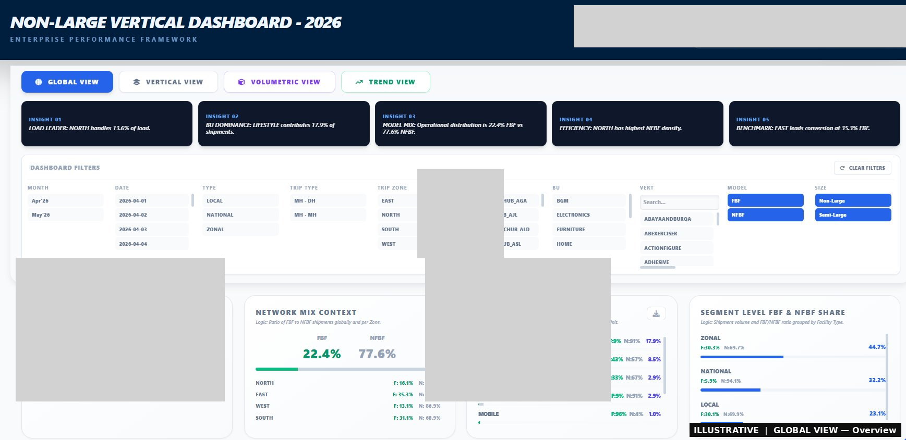
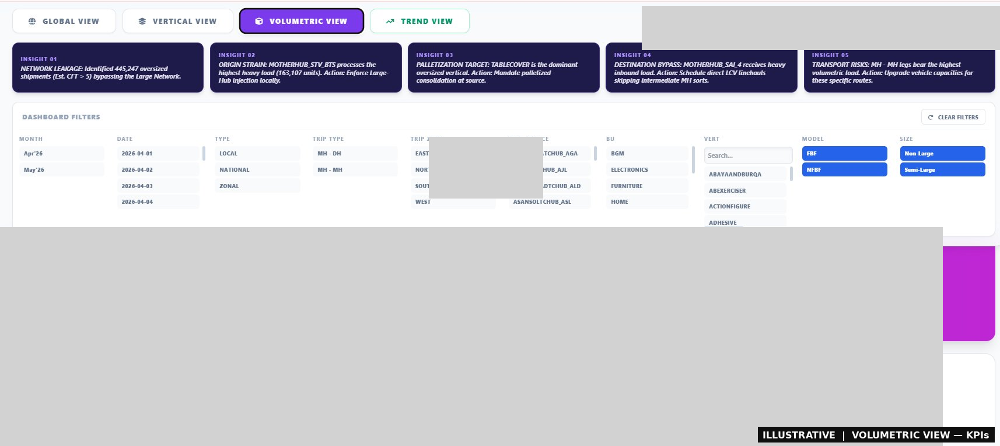
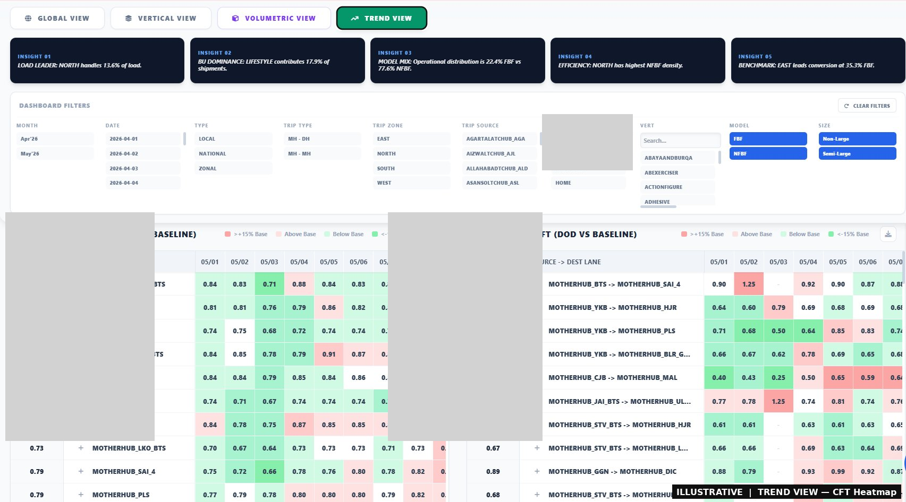
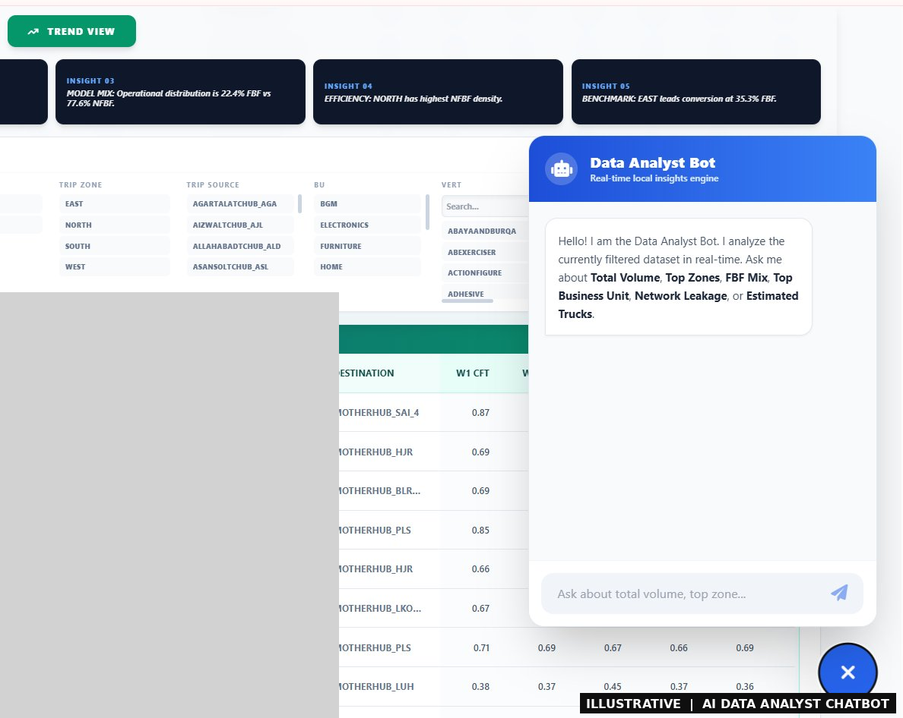

# 📦 Non-Large Vertical Dashboard

## Use Case
No single view existed for the Non-Large vertical across facilities, BUs, product verticals, and lanes. Oversized shipments flowing through the NL network were going undetected — causing load planning errors and untracked network leakage.

## How It Helped
Built an end-to-end Colab pipeline that streams raw CSVs, aggregates via DuckDB, and generates a self-contained HTML dashboard with CFT-based oversized detection, HCV diversion estimates, day-on-day trend tracking, and an embedded AI chatbot for natural language queries.

## My Role
Designed and built the full pipeline — data ingestion, aggregation logic, CFT estimation framework, dashboard UI across 4 views, and the embedded AI chatbot.

## Views

**Global View** — Regional distribution, FBF/NFBF network mix, BU utilisation, daily volume trend, and point-to-point lane volume table.

**Vertical View** — Top 5 product verticals by zone, facility dominance (primary & secondary), and segment-level pairings across National and Zonal centres.

**Volumetric View** — CFT-based oversized shipment detection, network leakage %, and estimated divertable HCV (32ft truck) loads by vertical and origin.

**Trend View** — Day-on-day CFT heatmap vs prior month baseline + weekly DRR per facility and lane with period-on-period change indicators.

**AI Chatbot** — Embedded local NLP bot that queries the live filtered dataset in plain English — no API calls, fully client-side.

## Output
Single portable HTML file (~15–40 MB) shareable via Drive or email — opens in any browser, works fully offline. Covers Global, Vertical, Volumetric & Trend views with full CSV export per section.

---
*Python · Polars · DuckDB · React 18 · Plotly · Google Colab*
