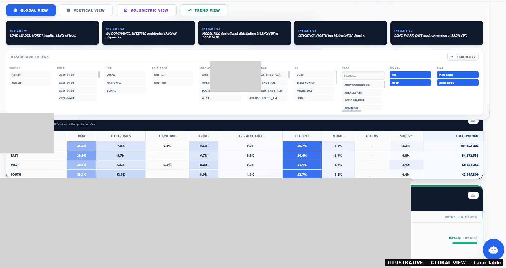
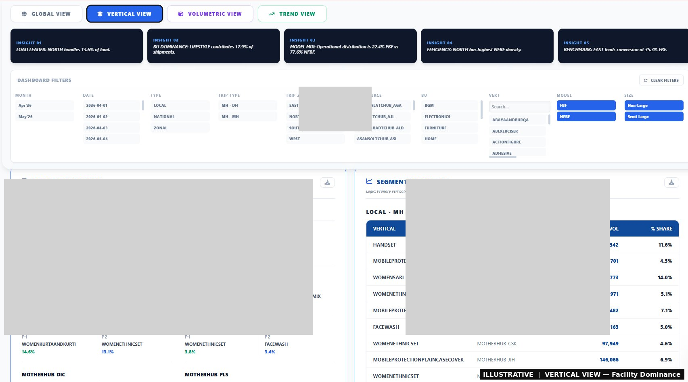
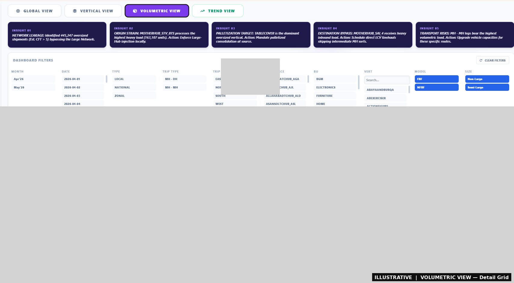
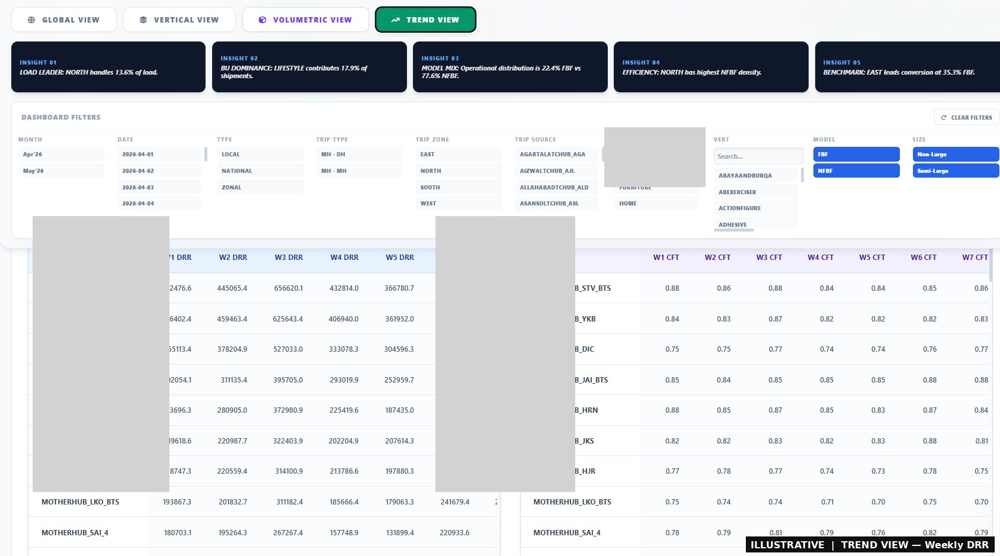
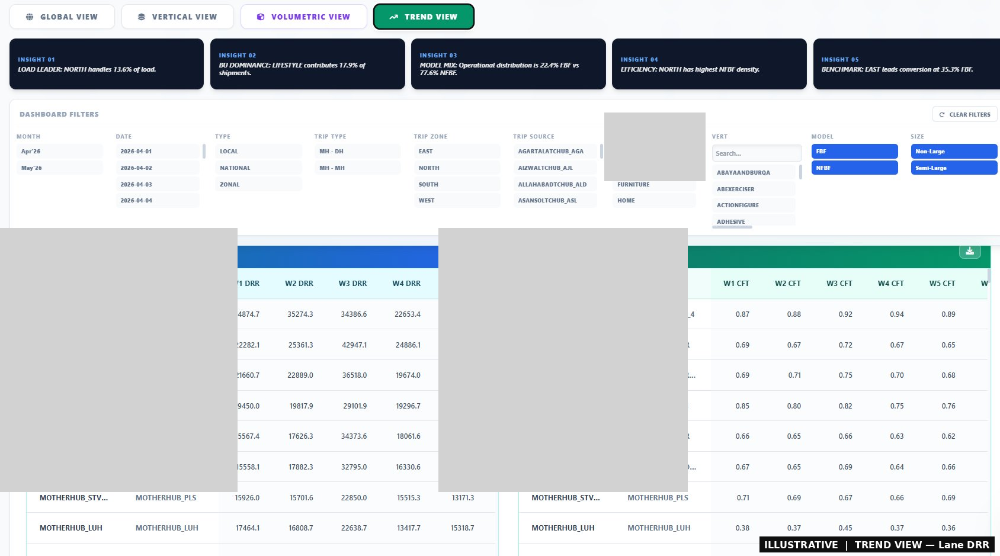

# 📦 Non-Large Vertical Dashboard — 2026

> **Enterprise Performance Framework** for Flipkart's Non-Large logistics network.
> Automated pipeline that transforms raw shipment CSVs into a fully interactive, zero-dependency HTML dashboard — shareable with any stakeholder with a single file download.

---

## 🧭 Project Overview

This project builds **end-to-end visibility** into Flipkart's Non-Large (NL) vertical shipment network. It was designed to answer operational questions at scale — across facilities, business units, product verticals, and transport lanes — and to surface volumetric anomalies (oversized shipments bypassing the Large network) automatically.

The pipeline runs entirely in **Google Colab**, reads raw CSV exports from the Flipkart Data Platform, aggregates them using **Polars + DuckDB**, and renders a fully self-contained **React + Plotly HTML dashboard** with an embedded AI chatbot for real-time querying.

**No server. No BI tool license. One HTML file. Shareable with anyone.**

---

## 📸 Dashboard Preview

### 🌐 Global View — Overview
Regional distribution, FBF/NFBF network mix, BU utilization, and daily volume trend.


---

### 🔗 Global View — Lane Table
Point-to-point volume mapping from Trip Source to Consignment Destination with BU split.



---

### 🗺️ Vertical View — Geographical
Top 5 product verticals by zone, overall vertical leaders, and zone-level volume split.


---

### 🏭 Vertical View — Facility Dominance & Segment Analytics
Primary and secondary vertical dominance across National and Zonal centers, with segment-level pairings.



---

### 📦 Volumetric View — KPIs & Inferences
AI-estimated oversized shipment detection, network leakage %, and divertable HCV truck loads.


---

### 🚨 Volumetric View — Detail Grid
Oversized verticals, affected origins, affected destinations, and strained lanes ranked by CFT load.



---

### 📊 Trend View — Day-on-Day CFT Heatmap
Facility and lane-level average CFT tracked daily vs prior month baseline, colour-coded by deviation band.


---

### 📅 Trend View — Weekly DRR (Facility)
Weekly Daily Run Rate and average CFT progression per facility with period-on-period change indicators.



---

### 🛣️ Trend View — Lane DRR
Weekly DRR and average CFT at source → destination lane level with trend direction flags.



---

### 🤖 AI Data Analyst Chatbot
Embedded local NLP bot for real-time contextual queries on the currently filtered dataset — no API calls.


---

## 🏗️ Architecture

```
Raw CSV (Flipkart Data Platform)
        │
        ▼
┌─────────────────────────────────┐
│  Google Colab + Google Drive    │
│                                 │
│  1. Polars: Streaming CSV parse │
│     + Data cleansing            │
│  2. DuckDB: Out-of-core merge   │
│     + Top-K aggregation         │
│  3. Integer dictionary encode   │
│     (columnar JSON, gzip)       │
│  4. Base64 embed into HTML      │
└─────────────────────────────────┘
        │
        ▼
┌─────────────────────────────────┐
│  Self-Contained HTML File       │
│                                 │
│  React 18 + Tailwind CSS        │
│  Plotly.js charts               │
│  fflate (in-browser decompress) │
│  Local AI Analyst Chatbot       │
└─────────────────────────────────┘
        │
        ▼
Shared with stakeholders via Drive / email
```

---

## 🚀 Quick Start

### Prerequisites

- Google account with Google Drive access
- Raw shipment CSV(s) exported from the Flipkart Data Platform
- Google Colab (free tier works; Pro recommended for large files)

### Step-by-Step

**1. Download raw data from Flipkart Data Platform**

Export your shipment-level report as CSV. The file must contain at minimum these columns:

```
event_trip_started_datetime, type, trip_type, trip_zone, trip_source, bu,
asset_tag, vert, consignment_source, consignment_destination,
fbf_bag_shipments, nfbf_bag_shipments,
fbf_semi_large_shipments, nfbf_semi_large_shipments,
fbf_semi_large_rev_shipments, nfbf_semi_large_rev_shipments
```

**2. Upload to Google Drive**

Place your CSV file(s) in:
```
MyDrive/NL_Vertical_Report-Apr-2026/
```
> Multiple CSVs in the same folder are automatically merged. Incremental files added later are processed without re-running old ones (cache-aware).

**3. Open and run the Colab notebook**

```
Open nl_vertical_dashboard.ipynb in Google Colab
Runtime → Run All
```

**4. Download the output**

The dashboard is written to:
```
MyDrive/NL_Vertical_Dashboard_2026.html
```

Open this file in any browser. No internet connection required after load (all assets are embedded).

---

## ⚙️ Configuration

At the top of the script, update these two paths to match your Drive structure:

```python
SOURCE_PATH = "/content/drive/MyDrive/NL_Vertical_Report-Apr-2026"
OUTPUT_PATH = "/content/drive/MyDrive/NL_Vertical_Dashboard_2026.html"
```

---

## 📂 Repository Structure

```
nl-vertical-dashboard/
│
├── nl_vertical_dashboard.py        # Core pipeline script (Colab-ready)
├── nl_vertical_dashboard.ipynb     # Colab notebook wrapper
│


│
├── sample_data/
│   └── sample_data.csv             # Minimal synthetic CSV for local testing
│
└── README.md
```

---

## 🔑 Key Features

### Data Pipeline
- **Streaming ingestion** via Polars `read_csv_batched` — handles files larger than RAM
- **Incremental caching** — previously processed CSVs are skipped on re-runs; only new files are processed
- **DuckDB out-of-core aggregation** — merges all cached Parquet chunks using spill-to-disk SQL
- **Integer dictionary encoding** — all string columns are encoded as integer IDs; the full lookup table is embedded separately, reducing payload size significantly
- **gzip + Base64 embedding** — the aggregated dataset is compressed (level 8) and embedded directly in the HTML, making the file fully portable

### Dashboard
- **Multi-view navigation**: Global → Vertical → Volumetric → Trend
- **Cross-filter interactions**: Click any chart element (zone, BU, date, facility) to drill down; active context chips appear in the toolbar
- **Model/Size filters**: Toggle FBF/NFBF and Non-Large/Semi-Large independently
- **Master Export**: Download the full filtered dataset as CSV in one click
- **Per-section exports**: Every table and chart has its own CSV export button

### Volumetric Intelligence
- AI-estimated CFT (Cubic Feet) per vertical using a 100+ item lookup table with keyword fallback
- Identifies oversized shipments (Est. CFT > 5) currently flowing through the Non-Large network
- Estimates divertable HCV (32ft truck) loads: `Total Oversized CFT ÷ 1,200`
- Surfaces top strained origins, destinations, and lanes

### Trend View
- **Day-on-Day CFT Heatmap**: Colour-coded vs prior month baseline (>+15%, above base, below base, <-15%)
- **Weekly DRR tables**: Volume and Avg CFT broken down by week at facility and lane level
- **Period comparison**: Automatic split into first 10 days vs remainder

### AI Data Analyst Chatbot
Embedded local bot (no API calls) that queries the currently filtered in-memory dataset. Supports natural language questions such as:

- *"What is the total volume in North?"*
- *"Top 5 facilities by oversized volume"*
- *"Which vertical avg CFT increased in Motherhub_GGN?"*
- *"Apr vs May FBF split for Zonal trips"*
- *"Top 3 lanes with decreasing CFT in the last 7 days"*
- *"Export top 10 verticals to CSV"*

The bot performs intent classification, dynamic context extraction from the lookups dictionary, algorithmic trend calculation, and optional CSV export — entirely client-side.

---

## 🧹 Data Cleansing Logic

The pipeline applies these transformations before aggregation:

| Rule | Detail |
|---|---|
| Source filter | Retain only rows where `trip_source` contains `motherhub` or `tchub` |
| Source exclusion | Drop rows containing `grocery`, `myntra`, `satellite`, `bulk`, `centralhub` |
| Zone correction | Override `trip_zone` for specific misclassified sources (e.g. Alite_Motherhub_BHO_SWB → West) |
| Asset tag override | Reclassify Panipat/Rajkot sources as NON-LARGE |
| BU normalisation | Merge `COREELECTRONICS` + `EMERGINGELECTRONICS` → `ELECTRONICS`; `GIFTCARD` + `REFURBISHED` → `OTHERS` |
| Volume columns | `fbf = fbf_bag + fbf_semi_large`; `nfbf = nfbf_bag + nfbf_semi_large` |
| Zero-volume drop | Remove rows where `total = 0` after aggregation |

---

## 📊 Dashboard Filter Dimensions

| Filter | Options |
|---|---|
| Month | Apr'26, May'26 |
| Date | Individual dates |
| Type | LOCAL / NATIONAL / ZONAL |
| Trip Type | MH-DH / MH-MH |
| Trip Zone | EAST / NORTH / SOUTH / WEST |
| Trip Source | All valid Motherhub/Tchub facilities |
| BU | BGM / ELECTRONICS / FURNITURE / HOME / LIFESTYLE / MOBILE / OTHERS / SHOPSY |
| Vert | Searchable product vertical list |
| Model | FBF / NFBF |
| Size | Non-Large / Semi-Large |

---

## 📤 Stakeholder Distribution

The output `NL_Vertical_Dashboard_2026.html` is a **single portable file** (~15–40 MB depending on data volume). It can be:

- Shared via Google Drive link
- Attached to email (if under size limit)
- Opened directly in any modern browser (Chrome, Edge, Firefox)
- Viewed offline — no server or internet required after the file is loaded

**Recommended audience**: Central Supply Chain team, Zonal Operations heads, Facility managers, NL Category/BU owners.

---

## 🛠️ Dependencies

| Library | Purpose |
|---|---|
| `polars` | Streaming CSV parsing and batch aggregation |
| `duckdb` | Out-of-core SQL merge of Parquet chunks |
| `gzip` / `base64` | Payload compression and HTML embedding |
| `pathlib` | Cross-platform file path handling |
| `react@18` | Dashboard UI (loaded from CDN on first open) |
| `plotly-2.24.1` | Interactive charts |
| `fflate@0.8.2` | In-browser gzip decompression |
| `tailwindcss` | Utility-first styling |
| `font-awesome@6` | Icons |

> CDN dependencies are loaded once on first browser open. After that, the HTML can be used offline.

---

## 🔒 Data Privacy Notes

- This script processes shipment-level operational data. Ensure CSV files are stored in a Drive folder with **restricted sharing** before running.
- The output HTML embeds aggregated (not row-level) data. Individual shipment IDs are not present in the dashboard payload.
- Do not commit raw CSV files or the generated HTML to this repository.

---

## 🗺️ Roadmap

- [ ] Automated scheduling via Colab + Drive API (weekly auto-refresh)
- [ ] Email distribution of the HTML file to a stakeholder list post-generation
- [ ] Multi-month rolling window support (beyond Apr–May)
- [ ] Anomaly alerting: flag facilities/lanes where CFT exceeds threshold by >20% WoW
- [ ] Zonal team filtered views: auto-generate zone-specific HTML variants

---

## 👤 Author

Built by **Sri Ranganatha Perumal Venkatesan**.
For access, questions, or onboarding, raise an issue in this repository or connect via GitHub.

---

*Logistics Intelligence Framework © 2026 | Supply Chain Hub*
